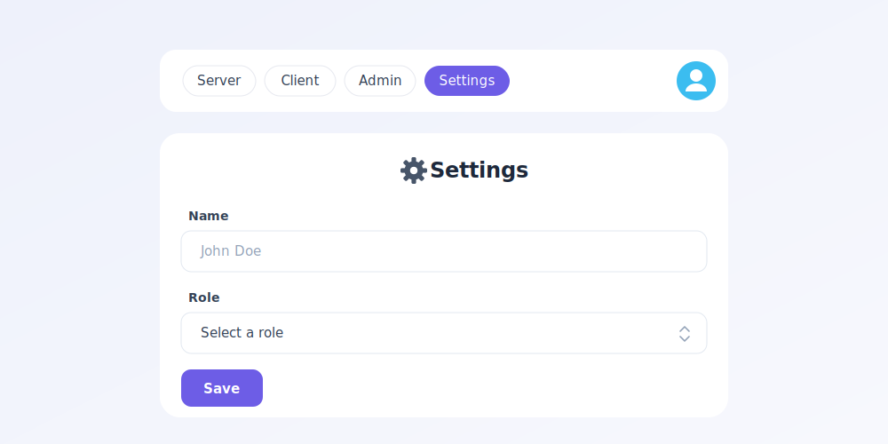
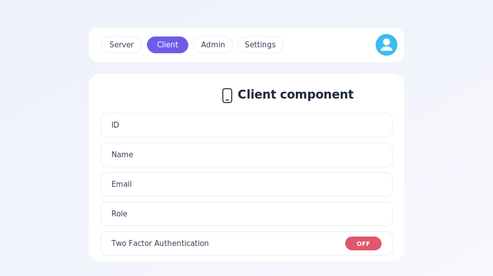
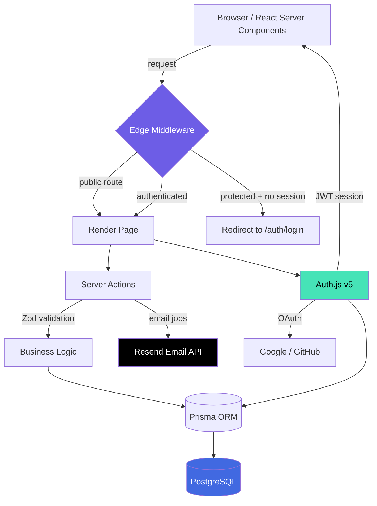
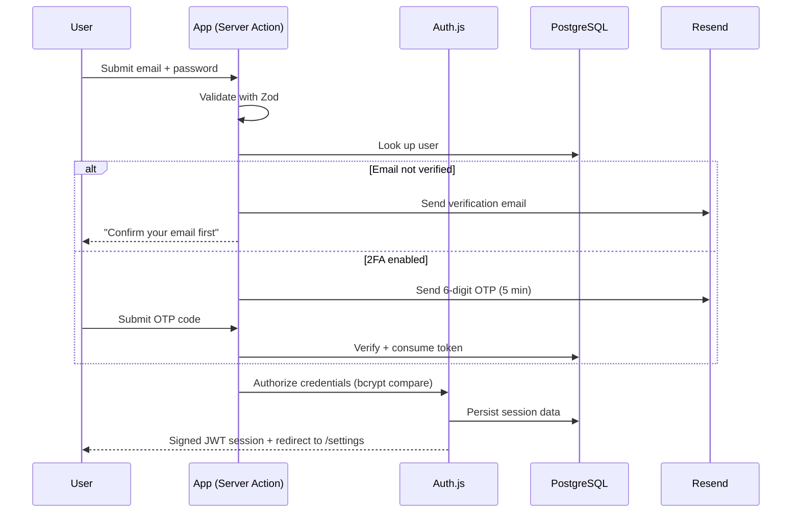

<div align="center">

# 🛡️ Advance Auth v6

### A production-grade, full-stack authentication & authorization platform built on Next.js 14 and Auth.js v5

*Credentials + OAuth · Email verification · Two-Factor Authentication · Role-Based Access Control · Server-Action security · Edge middleware*

<br/>


<sub><b>Status:</b> Active · <b>Type:</b> Full-Stack Auth Framework · <b>Rendering:</b> Server Components + Server Actions</sub>

</div>

---

## ✨ Executive Summary

**Advance Auth v6** is not a login form — it is a complete **identity and access-management (IAM) layer** engineered to the same standard you would expect from a commercial SaaS product. It solves the hardest, most security-sensitive problem in every application — *"who is this user, and what are they allowed to do?"* — and solves it end-to-end.

Every credential is hashed, every session is signed, every route is guarded at the edge, every mutation is validated on the server, and every privileged action is re-checked against the caller's role. The result is an authentication system that is **secure by default**, **type-safe from database to browser**, and **built entirely on the modern React Server Components architecture** — no legacy client-side auth hacks, no exposed secrets, no trust placed in the browser.

> **In one sentence:** a battle-tested authentication foundation that a team can drop into any product and ship on — covering the ninety-nine edge cases that usually only surface in production.

---

## 🖼️ Product Preview

The application ships with a polished, responsive interface built on **Radix UI** primitives and **Tailwind CSS**. Below are two representative surfaces — a role-aware **Settings** console and a live **Client Component** session inspector.

<table>
  <tr>
    <td width="50%" valign="top">
      
      <p align="center"><sub><b>Settings Console</b> — self-service profile, role and security management</sub></p>
    </td>
    <td width="50%" valign="top">
      
      <p align="center"><sub><b>Client Session Inspector</b> — real-time, hydrated session state on the client</sub></p>
    </td>
  </tr>
</table>

---

## 📇 Table of Contents

- [Why This Project Stands Out](#-why-this-project-stands-out)
- [Feature Deep-Dive](#-feature-deep-dive)
- [System Architecture](#-system-architecture)
- [The Authentication Lifecycle](#-the-authentication-lifecycle)
- [Security Posture](#-security-posture)
- [Technology Stack](#-technology-stack)
- [Project Structure](#-project-structure)
- [Getting Started](#-getting-started)
- [Environment Variables](#-environment-variables)
- [Roadmap](#-roadmap)

---

## 🏆 Why This Project Stands Out

Most authentication tutorials stop at *"the user can log in."* This project starts there and keeps going until the system is genuinely production-ready:

| Capability | Why it matters | Status |
| :--- | :--- | :---: |
| **Multi-strategy sign-in** | Users choose email/password *or* Google/GitHub — one unified identity, zero duplicate accounts | ✅ |
| **Email-verified accounts** | No unverified email can ever authenticate — kills fake sign-ups at the door | ✅ |
| **Two-Factor Authentication** | Time-boxed one-time codes add a second, out-of-band security layer | ✅ |
| **Role-Based Access Control** | The exact same content is served or blocked based on `ADMIN` vs `USER` role | ✅ |
| **Defense-in-depth** | Enforced at the **edge**, in the **UI**, in **API routes**, *and* in **server actions** | ✅ |
| **End-to-end type safety** | Prisma → Auth.js session → React — a single source of truth, checked at compile time | ✅ |
| **Self-service account control** | Users change name, email, password and security settings from one console | ✅ |

---

## 🔬 Feature Deep-Dive

<details open>
<summary><b>🔐 1. Dual-Strategy Authentication (Credentials + OAuth)</b></summary>

<br/>

The system authenticates users through **two independent, coexisting strategies**, unified behind a single Auth.js configuration:

- **Credentials provider** — email + password. Passwords are never stored in plaintext; they are hashed with **bcrypt** and compared using a constant-time algorithm that is resistant to timing attacks.
- **OAuth providers** — **Google** and **GitHub** social login. On first sign-in, an account is transparently linked and the email is auto-verified, because the provider has already vouched for it.

A carefully ordered `signIn` callback enforces the rules that OAuth users skip email verification (already trusted) while credential users must be verified — and, if two-factor is enabled, must additionally clear the 2FA challenge before a session is ever issued.

</details>

<details>
<summary><b>✉️ 2. Email Verification Pipeline</b></summary>

<br/>

New credential accounts are **inert until proven**. On registration the system:

1. Generates a cryptographically unique **UUID verification token** with a **1-hour expiry**.
2. Persists it, replacing any stale token for that address.
3. Dispatches a branded verification email through **Resend**.

Until the user clicks the link, every login attempt is rejected. This single guarantee eliminates an entire class of spam, impersonation, and typo-account problems.

</details>

<details>
<summary><b>📱 3. Two-Factor Authentication (2FA)</b></summary>

<br/>

For users who opt in, the login flow branches into a second, out-of-band challenge:

- A **6-digit numeric one-time passcode** is generated using a cryptographically secure random source.
- The code is **valid for only 5 minutes** and is single-use — it is deleted the moment it is confirmed.
- A short-lived `TwoFactorConfirmation` record gates the final session issuance and is consumed on each sign-in, so every new session requires a fresh challenge.

This turns a stolen password from a breach into a non-event.

</details>

<details>
<summary><b>🔑 4. Secure Password Reset</b></summary>

<br/>

The "forgot password" flow is fully tokenized and time-boxed:

1. A **UUID reset token** (1-hour expiry) is issued and emailed as a one-click link.
2. The new password is validated against a **Zod schema** and re-hashed with bcrypt.
3. In-app password changes additionally require **confirmation of the current password**, preventing account takeover from a hijacked session.

</details>

<details>
<summary><b>👑 5. Role-Based Access Control (RBAC)</b></summary>

<br/>

Every user carries an `ADMIN` or `USER` role, propagated all the way into the session token. Authorization is then enforced through **four independent layers** — a true defense-in-depth model:

| Layer | Mechanism | Example |
| :--- | :--- | :--- |
| **UI** | `<RoleGate>` component | Admin-only panels simply don't render for regular users |
| **Hook** | `useCurrentRole()` | Client components react to role in real time |
| **API** | Route-level guard | `/api/admin` returns `403` to non-admins |
| **Server Action** | Server-side role check | Privileged mutations refuse to execute for `USER` |

Because the check is repeated on the server for every privileged operation, a malicious client that bypasses the UI still hits a locked door.

</details>

<details>
<summary><b>🧩 6. Extended, Type-Safe Session</b></summary>

<br/>

Auth.js sessions are enriched through custom `jwt` and `session` callbacks so that the browser receives a **fully hydrated identity** — `id`, `role`, `isTwoFactorEnabled`, and `isOAuth` — without a single extra database round-trip. The session shape is declared in TypeScript (`next-auth.d.ts`), so every consumer of `useCurrentUser()` gets **autocomplete and compile-time safety** on custom fields.

</details>

<details>
<summary><b>🚧 7. Edge Middleware Route Protection</b></summary>

<br/>

A single Next.js **middleware** runs on the Edge runtime before any page renders. It classifies every request as public, auth, or protected and:

- Redirects **unauthenticated** users away from protected pages — preserving the original destination as a `callbackUrl` for a seamless post-login bounce.
- Redirects **already-authenticated** users away from login/register pages.
- Leaves API auth endpoints untouched.

Protection happens *before* a byte of protected UI is ever sent to the browser.

</details>

---

## 🏗️ System Architecture



---

## 🔄 The Authentication Lifecycle

The full login journey — including the branching for email verification and two-factor — modelled as a sequence:



---

## 🔒 Security Posture

Security is not a feature here — it is the architecture. A summary of the hardening built into the system:

- 🧂 **bcrypt password hashing** with constant-time comparison — no plaintext, ever.
- ⏱️ **Short-lived, single-use tokens** for verification (1h), password reset (1h) and 2FA (5m).
- 🔏 **Signed JWT sessions** — no server-side session store to leak or exhaust.
- 🧱 **Four-layer authorization** — edge, UI, API and server action all independently enforce role.
- 🧪 **Zod validation on every input** — malformed or malicious payloads are rejected before they reach business logic.
- 🙈 **Secrets stay server-side** — OAuth secrets, DB URLs and API keys live only in environment variables.
- 🔗 **OAuth account linking** with automatic email trust — no duplicate identities.
- 🚪 **Fail-closed defaults** — unknown roles, missing tokens and expired codes all resolve to *access denied*.

---

## 🧰 Technology Stack

| Layer | Technology | Purpose |
| :--- | :--- | :--- |
| **Framework** | Next.js 14 (App Router) | Server Components, Server Actions, Edge Middleware |
| **Language** | TypeScript | End-to-end static typing |
| **Auth** | Auth.js (NextAuth v5) | Sessions, providers, callbacks |
| **Database** | PostgreSQL + Prisma ORM | Type-safe persistence & migrations |
| **Validation** | Zod | Schema-first input validation |
| **Email** | Resend | Transactional verification & OTP mail |
| **UI** | Radix UI + Tailwind CSS | Accessible, composable components |
| **Forms** | React Hook Form | Performant, controlled form state |
| **Hashing** | bcrypt / bcryptjs | Password security |

---

## 📂 Project Structure

```
advance_auth_v6/
├── app/
│   ├── (protected)/          # Auth-gated area (server, client, admin, settings)
│   │   ├── _components/       # Protected-area navbar
│   │   └── settings/          # Self-service account console
│   ├── api/                   # Route handlers (incl. admin-only endpoint)
│   └── auth/                  # Login, register, reset, verification, error
├── actions/                   # Server Actions (login, register, settings, 2FA…)
├── auth.ts                    # Auth.js core config & callbacks
├── auth.config.ts             # Providers (Credentials, Google, GitHub)
├── middleware.ts              # Edge route protection
├── routes.ts                  # Public / auth / protected route maps
├── components/                # UI + auth components (RoleGate, forms, cards)
├── data/                      # Data-access helpers (user, tokens, 2FA)
├── hooks/                     # useCurrentUser, useCurrentRole
├── lib/                       # db, mail, tokens, utils
├── schemas/                   # Zod validation schemas
└── prisma/                    # Database schema
```

---

## 🚀 Getting Started

### Prerequisites

- **Node.js 18.7+**
- A **PostgreSQL** database
- **Resend**, **Google** and **GitHub** OAuth credentials

### 1 — Clone the repository

```bash
git clone https://github.com/suleman-the-stammer/advance_auth_v6.git
cd advance_auth_v6
```

### 2 — Install dependencies

```bash
npm install
```

### 3 — Configure environment

Create a `.env` file (see the [table below](#-environment-variables)).

### 4 — Sync the database

```bash
npx prisma generate
npx prisma db push
```

### 5 — Run the app

```bash
npm run dev
```

Visit **http://localhost:3000** 🎉

---

## 🔧 Environment Variables

| Variable | Description |
| :--- | :--- |
| `DATABASE_URL` | Pooled PostgreSQL connection string |
| `DIRECT_URL` | Direct connection (for Prisma migrations) |
| `AUTH_SECRET` | Secret used to sign session JWTs |
| `GOOGLE_CLIENT_ID` / `GOOGLE_CLIENT_SECRET` | Google OAuth credentials |
| `GITHUB_CLIENT_ID` / `GITHUB_CLIENT_SECRET` | GitHub OAuth credentials |
| `RESEND_API_KEY` | Resend transactional email key |
| `NEXT_PUBLIC_APP_URL` | Public base URL (used in email links) |

> 🔐 Every secret above is read **only on the server**. None are exposed to the browser except the intentionally public `NEXT_PUBLIC_APP_URL`.

---

## 🗺️ Roadmap

- [ ] Authenticator-app (TOTP) 2FA alongside email OTP
- [ ] Passkey / WebAuthn passwordless sign-in
- [ ] Admin dashboard with audit logging
- [ ] Rate limiting on auth endpoints
- [ ] Session device management & remote revocation

---

<div align="center">

### Built with precision, secured by design.

<sub>Engineered on Next.js 14 · Auth.js v5 · Prisma · PostgreSQL</sub>

</div>
